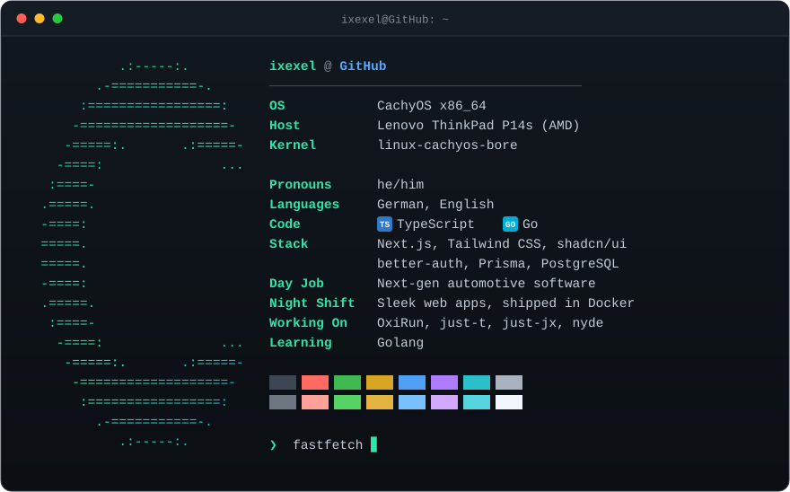

<p align="center">
  
</p>

<details>
<summary>plain text</summary>

```
$ fastfetch

            .:-----:.                ixexel@cachyos
         .-===========-.             ----------------------------------------
       :=================:           OS ............ CachyOS x86_64
      -===================-          Host .......... Lenovo ThinkPad P14s (AMD)
     -=====:.       .:=====-         Kernel ........ linux-cachyos-bore
    -====:               ...
   :====-                            Pronouns ...... he/him
  .=====.                            Languages ..... German, English
  -====:                             Code .......... TypeScript, Go
  =====.                             Stack ......... Next.js, Tailwind CSS, shadcn/ui
  =====.                             .................. better-auth, Prisma, PostgreSQL
  -====:
  .=====.                            Day Job ....... Next-gen automotive software
   :====-                            Night Shift ... Sleek web apps, shipped in Docker
    -====:               ...         Working On .... OxiRun, just-t, just-jx, nyde
     -=====:.       .:=====-
      -===================-          Learning ...... Golang
       :=================:
         .-===========-.             ███ ███ ███ ███ ███ ███ ███ ███
            .:-----:.                ███ ███ ███ ███ ███ ███ ███ ███
```

</details>
